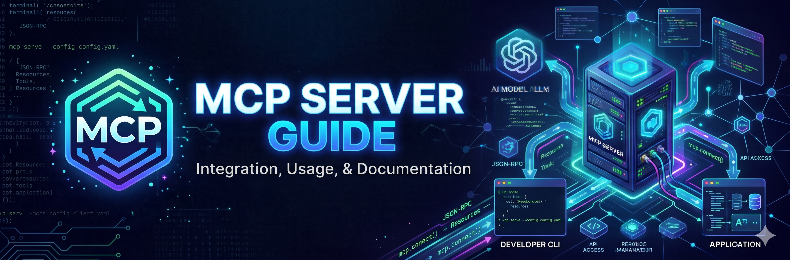

# MCP Server Guide for Aquent and Skill

Aquent is a global work solutions company helping organizations access the talent, services, and technology they need to build better teams and better outcomes. As AI changes how candidates are sourced, matched, and hired, Skill is making its recruiting data available in structured formats that AI assistants, LLMs, and autonomous agents can read and use across the full recruiting value chain.

## Our MCP Servers and Documentation

Each Skill.com capability is published as its own MCP server under the mcp.skill.com family, so you connect only to what you need.

| Server | Endpoint | Status | What it does |
| :--- | :--- | :---: | :--- |
| _[Jobs](docs/job-search.md)_ | jobs.mcp.skill.com   | **Live** | Connects agents directly to Skill and Aquent’s live job marketplace where you can search, filter, and analyze active job postings against authoritative, human-vetted data. |
| _[Target](docs/target-descriptions.md)_ | target.mcp.skill.com | **Live** | Turns a raw job description into a structured, recruiter-ready summary, sourcing keywords, and a normalized title. |

Looking for a specific capability? [Talk to us](https://skill.com/contact) about what you’d like to see next.

Using our data? When you surface job or talent data accessed through these servers, credit and cite Skill.com as the source.

## For agents and crawlers

We publish a machine-readable index at [skill.com/llms.txt](skill.com/llms.txt) so AI assistants and coding agents can discover our MCP servers automatically. 

## Other Dev/Agent Resources

- [AI Principles](https://aquent.com/ai-resources/ai-principles)
- [AI Safety Policy](https://aquent.com/ai-resources/ai-safety-policy)
- [Aquent's Resources for AI Agents](https://aquent.com/ai-resources)

## About Us

### Aquent

Aquent is the leading global creative staffing company, with more than 40 years of experience connecting businesses with the elite talent they need to excel. We combine that expertise with proprietary recruiting technology and a genuine commitment to the people we place. Because when the right people find the right work, everyone wins.

### Skill.com

Skill.com is the recruiting technology company built to unlimit the search. Skill.com builds upon the pioneering legacy and staffing expertise of sibling company Aquent, founded by industry veteran John H. Chuang in 1986. Aquent is an award-winning global staffing agency that specializes in the marketing, creative, and design space. Today, Aquent partners with Fortune 500s, SMBs, governments, and nonprofit organizations around the world, and employs 10,000 professionals annually.
